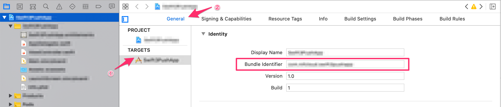
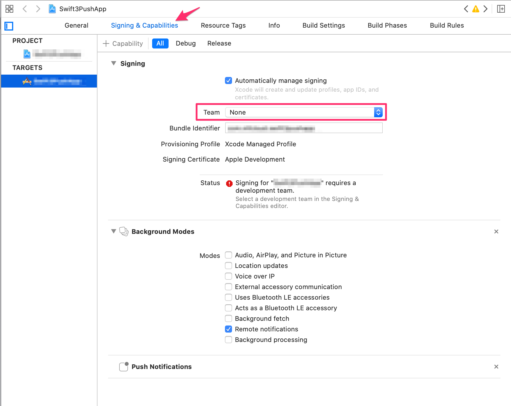

# 【Swift】<br>プッシュ通知受信時にWebViewを表示しよう(リッチプッシュ)
*2016/10/26作成（2020/06/11更新）*


## 概要
* [ニフクラmobile backend](https://mbaas.nifcloud.com/)の『プッシュ通知』機能において、プッシュ通知にURLを設定し配信できる『リッチプッシュ』機能を実装したサンプルプロジェクトです
* リッチプッシュ機能を使うと、プッシュ通知にURLを設定し配信を行った場合、ユーザープッシュ通知を開封する際にWebViewとして表示することが可能です
* 簡単な操作ですぐに [ニフクラmobile backend](https://mbaas.nifcloud.com/)の機能を体験いただけます★☆
* このサンプルはSwift5（iOS13）に対応しています

## ニフクラmobile backendって何？？
スマートフォンアプリのバックエンド機能（プッシュ通知・データストア・会員管理・ファイルストア・SNS連携・位置情報検索・スクリプト）が**開発不要**、しかも基本**無料**(注1)で使えるクラウドサービス！

注1：詳しくは[こちら](https://mbaas.nifcloud.com/price.htm)をご覧ください


## 動作環境

* Mac OS 10.15(Catalina)
* Xcode ver. 12.0
* iPhone11 (iOS14.0)
 * このサンプルアプリは、プッシュ通知を受信する必要があるため実機ビルドが必要です

※上記内容で動作確認をしています

## プッシュ通知の仕組み
* ニフクラ mobile backendのプッシュ通知は、iOSが提供している通知サービスを利用しています
 * iOSの通知サービス　__APNs（Apple Push Notification Service）__

 

* 上図のように、アプリ（Xcode）・サーバー（ニフクラmobile backend）・通知サービス（APNs）の間でやり取りを行うため、認証が必要になります
 * 認証に必要な鍵や証明書の作成は作業手順の「0.プッシュ通知機能使うための準備」で行います

## 作業の手順
### 0.プッシュ通知機能使うための準備
__[【iOS】プッシュ通知の受信に必要な証明書の作り方(開発用)](https://github.com/NIFCLOUD-mbaas/iOS_Certificate)__
* 上記のドキュメントをご覧の上、必要な証明書類の作成をお願いします
 * 証明書の作成には[Apple Developer Program](https://developer.apple.com/account/)の登録（有料）が必要です


### 1. [ニフクラmobile backend](https://mbaas.nifcloud.com/)の会員登録とログイン→アプリ作成と設定
* 上記リンクから会員登録（無料）をします。登録ができたらログインをすると下図のように「アプリの新規作成」画面が出るのでアプリを作成します


* アプリ作成されると下図のような画面になります
* この２種類のAPIキー（アプリケーションキーとクライアントキー）はXcodeで作成するiOSアプリに[ニフクラmobile backend](https://mbaas.nifcloud.com/)を紐付けるために使用します


* 続けてプッシュ通知の設定を行います
* ここで⑦APNs用証明書(.p12)の設定も行います


### 2. GitHubからサンプルプロジェクトをダウンロード

* 下記リンクをブラウザで実行してプロジェクトをMacにダウンロードします
 * `https://github.com/NIFCLOUD-mbaas/SwiftRichPushApp/archive/master.zip`

### 3. Xcodeでアプリを起動

* ダウンロードしたフォルダを開き、「__SwiftRichPushApp.xcworkspace__」をダブルクリックしてXcode開きます(白い方です)


* 「SwiftRichPushApp.xcodeproj」（青い方）ではないので注意してください！


### 4. APIキーの設定

* `AppDelegate.swift`を編集します
* 先程[ニフクラmobile backend](https://mbaas.nifcloud.com/)のダッシュボード上で確認したAPIキーを貼り付けます


* それぞれ`YOUR_NCMB_APPLICATION_KEY`と`YOUR_NCMB_CLIENT_KEY`の部分を書き換えます
 * このとき、ダブルクォーテーション（`"`）を消さないように注意してください！
* 書き換え終わったら`command + s`キーで保存をします

### 5. 実機ビルド
* 始めて実機ビルドをする場合は、Xcodeにアカウント（AppleID）の登録をします
 * メニューバーの「Xcode」＞「Preferences...」を選択します
 * Accounts画面が開いたら、左下の「＋」をクリックします。
 * Apple IDとPasswordを入力して、「Add」をクリックします

 

 * 追加されると、下図のようになります。追加した情報があっていればOKです
 * 確認できたら閉じます。

 

 * 次に「TARGETS」 ＞「General」を開きます
 * 「Idenrity」＞「Bundle Identifier」を入力します
   * AppID 作成時に指定した「Bundle ID」を入力してください

 <center></center>

 * 次に「TARGETS」 ＞「Signing & Capabilities」を開きます
 * 「Teame」を選択します
   * 先ほど「Preferences」で設定したアカウント情報を選択します
   * 「Bundle Identifier」に応じて正しい「Provisioning Profile」が選択されればOKです
   * 正しく読み込まれない場合は、ダウンロードしたプロビジョニングプロファイルを一度 __ダブルクリック__ して読み込んだ後リトライしてください

 <center></center>

 * 上記画像の下方に表示されている「Push Notifications」はプッシュ通知を利用するために必要な設定です
   * このサンプルでは予め設定してあります
   * 上方「+Capability」から追加できます
* 設定は完了です
* lightningケーブルで登録した動作確認用iPhoneをMacにつなぎます
* Xcode画面で左上で、接続したiPhoneを選び、実行ボタン（さんかくの再生マーク）をクリックします

### 6.動作確認
* インストールしたアプリを起動します
 * プッシュ通知の許可を求めるアラートが出たら、必ず許可してください！
* 起動されたらこの時点でデバイストークンが取得されます
* [ニフクラmobile backend](https://mbaas.nifcloud.com/)のダッシュボードで「データストア」＞「installation」クラスを確認してみましょう！


### 7.リッチプッシュを送ってWebViewを表示させましょう
* 動作確認のため、アプリを完全に閉じておきましょう
* [ニフクラmobile backend](https://mbaas.nifcloud.com/)のダッシュボードで「プッシュ通知」＞「＋新しいプッシュ通知」をクリックします
* プッシュ通知のフォームが開かれます
* タイトル、メッセージ、__URL__ を入力してプッシュ通知を作成します


* 端末を確認しましょう！
* アプリの状態により、WebView（リッチプッシュ）の表示のされ方は以下のようになります

#### アプリが起動していないときプッシュ通知を受信した場合
* アプリを __完全に閉じた状態__ でプッシュ通知を送った場合は、プッシュ通知が受信されます
* 受信したプッシュ通知をタップするとWebViewが画面に表示されます
* 画面下の「Close」をタップするとWebViewが閉じ、裏で起動していたアプリが表示されます
 * リッチプッシュによって表示されるWebViewは一度い閉じると再表示できません。


#### アプリが起動しているときプッシュ通知を受信した場合
* アプリを起動している（画面に表示中/バックグラウンド起動中）状態でプッシュ通知を送った場合は、プッシュ通知自体は __表示されません__ ！（iOSの仕様）ただし、プッシュ通知が受信できていないわけではなく、正しく配信されていれば、WebViewが画面に表示されます

## 解説
### SDKのインポートと初期設定
* ニフクラmobile backend の[ドキュメント（クイックスタート）](https://mbaas.nifcloud.com/doc/current/introduction/quickstart_swift.html)をSwift版に書き換えたドキュメントをご用意していますので、ご活用ください

### コード紹介
#### デバイストークン取得とニフクラmobile backendへの保存
 * `AppDelegate.swift`の`didFinishLaunchingWithOptions`メソッドにAPNsに対してデバイストークンの要求するコードを記述し、デバイストークンが取得された後に呼び出される`didRegisterForRemoteNotificationsWithDeviceToken`メソッドを追記をします
 * デバイストークンの要求はiOSのバージョンによってコードが異なります

```swift
//
//  AppDelegate.swift
//  SwiftRichPushApp
//
//  Created by Ikeda Natsumo on 2016/12/08 (update on 2020/03/23).
//  Copyright 2020 FUJITSU CLOUD TECHNOLOGIES LIMITED All Rights Reserved.
//

import UIKit
import NCMB
import UserNotifications

@UIApplicationMain
class AppDelegate: UIResponder, UIApplicationDelegate, UNUserNotificationCenterDelegate {

    var window: UIWindow?

    // APIキーの設定
    let applicationkey = "YOUR_NCMB_APPLICATIONKEY"
    let clientkey      = "YOUR_NCMB_CLIENTKEY"

    func application(_ application: UIApplication, didFinishLaunchingWithOptions launchOptions: [UIApplication.LaunchOptionsKey: Any]?) -> Bool {
        // Override point for customization after application launch.

        // SDKの初期化
        NCMB.initialize(applicationKey: applicationkey, clientKey: clientkey)

        // Register notification
        registerForPushNotifications()

        // MARK: アプリが起動されるときに実行される処理を追記する場所
        if let notification = launchOptions?[.remoteNotification] as? [String: AnyObject] {
            NCMBPush.handleRichPush(userInfo: notification)
        }

        return true
    }

    // デバイストークンが取得されたら呼び出されるメソッド
    func application(_ application: UIApplication, didRegisterForRemoteNotificationsWithDeviceToken deviceToken: Data) {
        let tokenParts = deviceToken.map { data in String(format: "%02.2hhx", data) }
        let token = tokenParts.joined()
        print("Device Token: \(token)")

        let installation = NCMBInstallation()
        installation.setDeviceTokenFromData(data: deviceToken)
        installation.saveInBackground { (error) in

        }
    }


    func application(
        _ application: UIApplication,
        didFailToRegisterForRemoteNotificationsWithError error: Error) {
        print("Failed to register: \(error)")
    }

    func application(_ application: UIApplication, didReceiveRemoteNotification userInfo: [AnyHashable: Any], fetchCompletionHandler completionHandler: @escaping (UIBackgroundFetchResult) -> Void) {

        if let notiData = userInfo as? [String : AnyObject] {
            NCMBPush.handleRichPush(userInfo: notiData)
        }
    }

    func registerForPushNotifications() {
        UNUserNotificationCenter.current() // 1
            .requestAuthorization(options: [.alert, .sound, .badge]) { // 2
                granted, error in
                print("Permission granted: \(granted)") // 3
                guard granted else { return }
                self.getNotificationSettings()
        }
    }

    func getNotificationSettings() {
        UNUserNotificationCenter.current().getNotificationSettings { settings in
            print("Notification settings: \(settings)")
            guard settings.authorizationStatus == .authorized else { return }
            DispatchQueue.main.async {
                UIApplication.shared.registerForRemoteNotifications()
            }

        }
    }

}
```

#### リッチプッシュの取得
##### __アプリが起動されるときプッシュ通知を開封する場合__
* アプリが起動されるときプッシュ通知を開封するる場合の処理は、`didFinishLaunchingWithOptions`メソッド内に記述します

```swift
// MARK: アプリが起動されるときに実行される処理を追記する場所
if let userInfo = launchOptions?[UIApplicationLaunchOptionsKey.remoteNotification] as! [AnyHashable : Any]! {
    // リッチプッシュを表示させる処理
    NCMBPush.handleRichPush(userInfo)
}
```

<!-- プロジェクトに実装なし
##### __アプリが起動しているときプッシュ通知を開封する場合__
* アプリが起動しているとき起動中に開封するため、`didReceiveRemoteNotification`メソッドを追記し、記述します

```swift
// MARK: アプリが起動しているときに実行される処理を追記する場所
func application(_ application: UIApplication, didReceiveRemoteNotification userInfo: [AnyHashable : Any], fetchCompletionHandler completionHandler: @escaping (UIBackgroundFetchResult) -> Void) {
    // リッチプッシュを表示させる処理
    NCMBPush.handleRichPush(userInfo)
}
``` -->

#### iOS9以上におけるhttp通信設定
iOS9以降の端末ではhttps通信でないとリッチプッシュのWebViewで画像を表示することができません。そのためhttps通信の許可設定をする必要があります。

* `Info.plist`に下記を追記します


* コードの場合は以下のように設定します

```plist:Info.plist
<key>NSAppTransportSecurity</key>
<dict>
    <key>NSAllowsArbitraryLoads</key>
    <true/>
</dict>
```
